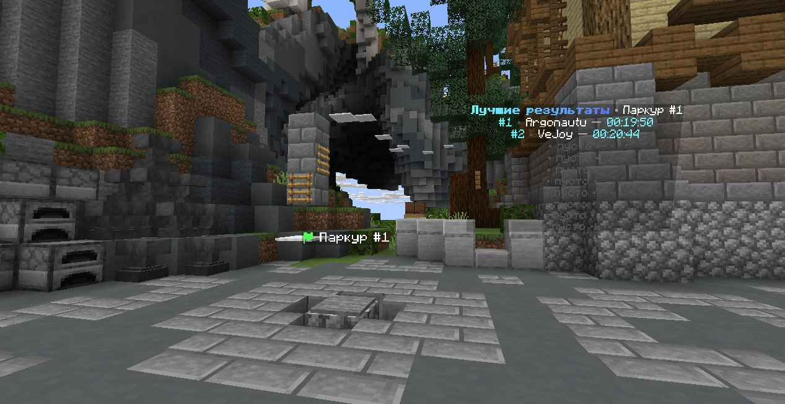

# parkour-remake

Fork of [Crumb-Network/Lobby-Parkour](https://github.com/Crumb-Network/Lobby-Parkour), extended for hub usage with persistent records, live leaderboards, holograms, and optional proxy-wide record announcements.

## What this fork adds

* MySQL-backed parkour and record storage
* Live per-parkour leaderboards
* FancyHolograms integration for plate and leaderboard presentation
* Action bar timer/progress display while running a parkour
* Optional Velocity/proxy record broadcasts over `hubparkour:records`
* Configurable global top announcement behavior
* More hub-oriented formatting and messaging defaults

## Screenshot

### Parkour leaderboard



## Core Features

* Start, end, and checkpoint plates
* Custom formatting for each plate type
* Custom start, checkpoint, cancel, reset, and finish messages
* Parkour renaming and checkpoint relocation
* Support for multiple parkours on the same server
* Configurable timer formatting

## Requirements

* Bukkit/Paper/Purpur-compatible server
* Java 21 for building this fork
* MySQL or MariaDB if `database.enabled: true`

Optional integrations:

* `FancyHolograms`
* `PlaceholderAPI`
* `hubparkour-velocity` on your Velocity proxy if you want network-wide record broadcasts

## Installation

1. Build the plugin jar.
2. Put the jar into your backend server `plugins` folder.
3. Start the server once to generate `config.yml`.
4. Configure your database connection.
5. Optionally install `FancyHolograms` and `PlaceholderAPI`.
6. If you use a proxy, optionally install `hubparkour-velocity` and enable the `velocity` section in the config.
7. Restart the server.

## Downloads

* Source repository: `https://github.com/Ve-Jo/parkour-remake`
* Releases page: `https://github.com/Ve-Jo/parkour-remake/releases`

If a release is available, you can download the prebuilt jar from GitHub Releases instead of building the project yourself.

## Building

```bash
./gradlew shadowJar
```

## Command

* `/parkour`
  - Main admin/management command

### Setup and admin commands

* `/parkour create <name>`
  - Create a new parkour entry in storage
* `/parkour setstart <name>`
  - Stand on or look at a pressure plate to set the start plate
* `/parkour setend <name>`
  - Stand on or look at a pressure plate to set the finish plate
* `/parkour addcheckpoint <name>`
  - Stand on or look at a pressure plate to append the next checkpoint
* `/parkour delcheckpoint <name> <index>`
  - Remove a checkpoint by numeric index
* `/parkour leaderboard place <name>`
  - Place a leaderboard hologram/display near the targeted plate or your current position
* `/parkour leaderboard remove <id>`
  - Remove a placed leaderboard by ID
* `/parkour rename <old name> -> <new name>`
  - Rename an existing parkour
* `/parkour delete <name>`
  - Delete a parkour
* `/parkour list`
  - List cached parkours
* `/parkour gui`
  - Open the admin GUI
* `/parkour menu`
  - Open the player parkour GUI
* `/parkour last`
  - Teleport to the last reached checkpoint
* `/parkour leave`
  - Leave the current run
* `/parkour reload`
  - Reload config, cache, and leaderboard services

## Permission

* `hubparkour.admin`
  - Default: `op`

## Configuration

Main configuration file:

* `src/main/resources/config.yml`

### Main sections

* `database`
  - MySQL connection settings
  - pool size, SSL, and auto-create behavior

* `parkour`
  - flight allowance
  - timeout behavior
  - action bar toggle and interval

* `formatting`
  - plate text
  - timer format
  - start/end/checkpoint/reset messages
  - action bar layout

* `leaderboards`
  - enable/disable leaderboard system
  - query/update intervals
  - formatting for lines, titles, and item display
  - top broadcast threshold

* `holograms`
  - enable/disable hologram updates
  - update interval

* `velocity`
  - enable/disable proxy announcements
  - plugin messaging channel
  - per-record and global-top broadcast formats

### Example database configuration

```yaml
database:
  enabled: true
  host: localhost
  port: 3306
  name: parkour
  user: root
  password: "change-me"
  pool-size: 10
  use-ssl: false
  create-database: true
```

### Example gameplay and formatting configuration

```yaml
parkour:
  allow-fly: false
  timeout-seconds: 0
  action-bar-enabled: true
  action-bar-interval-ticks: 1

formatting:
  start-plate: "<green>⚑</green> <white>%parkour_name%</white>"
  end-plate: "<red>⚑</red> <white>%parkour_name%</white>"
  checkpoint-plate: "<blue>⚑</blue> <gray>(%checkpoint%/%checkpoint_total%) <white>%parkour_name%</white>"
  timer: "%m%:%s%:%ms%"
  start-message: "<color:#ff9c40>☄</color> <color:#474747>»</color> <color:#ffed8a>Вы начали <white>%parkour_name%</white>. Удачи!</color>"
  checkpoint-message: "<color:#ff9c40>☄</color> <color:#474747>»</color> <color:#ffed8a>Вы достигли <white>чекпоинта №%checkpoint%</white> за <white>%timer%</white>.</color>"
  action-bar: "<color:#7ae0ff>%timer%</color> <color:#39aacc>⌚</color>   <dark_gray>|</dark_gray>   <color:#ffc157>Record:</color> <yellow>%record%</yellow>   <dark_gray>|</dark_gray>   <color:#54ff7f><color:#57ff65>%checkpoint%</color></color><color:#b8b8b8>/%checkpoint_total%</color> <green>⚑</green>"
```

### Example leaderboard configuration

```yaml
leaderboards:
  enabled: true
  update-interval-ticks: 100
  query-interval-ticks: 200
  broadcast-top: 5

  formatting:
    title: "<gradient:#6efcff:#5a7dff><bold>Лучшие результаты</bold></gradient> <gray>•</gray> <white>%parkour_name%</white>"
    maximum-displayed: 10
    default-line-style: "<aqua>#%position%</aqua> <dark_gray>•</dark_gray> <white>%player_name%</white> <gray>—</gray> <color:#7cf4ff>%timer%</color>"

  display-item:
    enabled: true
    item: "minecraft:stone"
    enchant-glint: true
```

### Example Velocity integration

```yaml
velocity:
  enabled: true
  channel: "hubparkour:records"
  broadcast-format: "<gold>[Parkour]</gold> <yellow>%player_name%</yellow> set a new record on <white>%parkour_name%</white>: <green>%timer%</green> (#%position%)"
  global-broadcast-top: 5
```

## Proxy Integration

If `velocity.enabled` is turned on, this plugin sends record announcements over:

* `hubparkour:records`

To broadcast those messages to the whole proxy, install:

* `hubparkour-velocity`

on your Velocity proxy.

## Technical Notes

* Plugin name: `HubParkour`
* Main class: `org.ayosynk.hubparkour.HubParkourPlugin`
* Soft dependencies: `PlaceholderAPI`, `FancyHolograms`
* Default version in source: `0.1.0-SNAPSHOT`

## Credits

* Original project: `Crumb-Network/Lobby-Parkour`
* Fork customizations and maintenance: `ayosynk`
